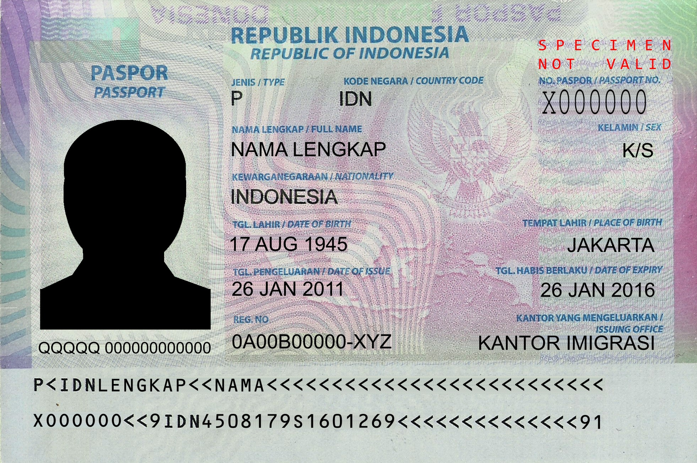

# Passport-Data-Extractor-OCR
## Project Overview

This project is a Python application for extracting data from passport images. It utilizes Optical Character Recognition (OCR) to read information from Machine Readable Zones (MRZ) and other parts of the passport.

## Features
- Extracts data from the MRZ (Machine Readable Zone) of the passport.
- Finds the issuing authority and date of issue.
- Uses EasyOCR for text recognition.
- Handles country codes and date parsing.

## Installation
1. Clone the repository:
    ```bash
    git clone https://github.com/abdallah-elsawy/Passport-Data-Extractor---OCR
    cd Passport-Data-Extractor---OCR
    ```

2. Install the required packages:
    ```bash
    pip install -r requirements.txt
    ```

## Usage
1. Place your passport images in the `images/` directory.
2. Update the `country_codes_file` and `img_name` variables in `passport_data_extractor.py` with appropriate paths.
3. Run the script:
    ```bash
    python passport_data_extractor.py
    ```

## Example
```python
country_codes_file = 'data/CC.json'
img_name = 'images/Iceland.jpg'
extractor = PassportDataExtractor(country_codes_file)
data = extractor.get_data(img_name)
extractor.print_data(data)
```





```
# Output

Name	:	NAMA LENGKAP
Date of birth	:	17/08/1945
Date of expiry	:	26/01/2016
Nationality	:	Indonesia
Passport type	:	P
Passport number	:	X00000O
Authority	:	
Date of issue	:	26/01/2011
```


